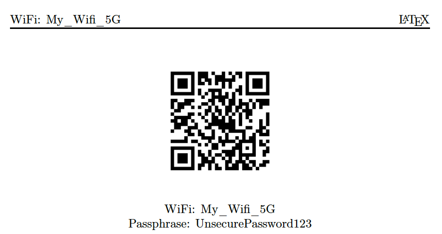

# wifiqr
Generate the printable PDF with QR Code and PSK for specified WIFI credentials

[![BSD licensed][bsd-badge]][bsd-link]

## Why?
 - Because I care about security.
 - Because I often change the password on my home guest network and want it still be quickly accessible for all the authorised guests.
I simply print out the pdf and put it under the magnet on my fridge ;)

## What does it do?
The tool takes the WiFi details (ESSID, Encryption type (WEP/WPA/WPA2) and the PSK) and generates the QR-code for easy
user authentication.
If the passprase is not being specified, this tool will automatically generate the 63 characters secure passphrase for
WPA/WPA2 encryption and 13 character passphrase for WEP encryption. It is generally advised against using WEP as it is
considered unsecure, so avoid it if possible.

For example, run the following command:

	./wifiqr.sh -o My_Wifi_5G WPA2 UnsecurePassword123

Result will look this way:

## Dependencies
Depends on:

  - **pwgen**
  - **qrencode**
  - **coreutils** *(GNU version)*
  - **pdflatex** (mactex on MacOS or latex on Linux)

MacOS: install dependencies with [Homebrew][homebrew]:

Install mactex(pdflatex):

	brew cask install mactex

Install coreutils:

	brew install coreutils qrencode pwgen

## Usage

Do `./wifiqr.sh -h` or simply `./wifiqr.sh` for help

Note: Try to avoid special symbols in the passwords as for now they are being incorrectly processed by latex.
In order to make your network secure it is recommended to use WPA/WPA2 Encryption type along with the automatically generated 63
character password (see -h).

## License

[BSD][bsd-link]

## Author Information

Andrew Shagayev | [e-mail](mailto:drewshg@gmail.com)

[bsd-badge]: https://img.shields.io/badge/license-BSD-blue.svg
[bsd-link]: https://raw.githubusercontent.com/drew-kun/gpgbackup/master/LICENSE
[homebrew]: http://brew.sh/
